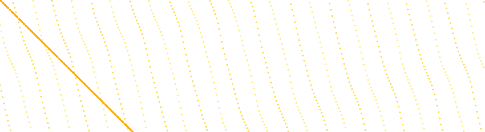

# The phenomenon

<!-- This is the SD5913 assignment 2 template. Everything in this file is yours to
replace, and the check counts words: comments like this one are not words, so
delete each one as you write. Start with the heading: name the phenomenon.

Then, in this order, at least 150 words in total.

New to folders, paths, or the files here whose names start with a dot? Read
https://github.com/sd5913/pfad/blob/2026/reference/files.md first. Ten minutes. -->



## The phenomenon
The time at which the moon rises, reaches its highest point in the sky, and sets changes significantly every day throughout the year. This shifting rhythm arises from the moon’s orbital movement around Earth. I chose this dataset to visualise this cyclic lunar behaviour, exploring how the moon’s visible schedule shifts day‑by‑day across the whole of 2026. It is interesting to observe that on some days the moon does not reach a recorded highest‑transit time, leaving a gap within the calendar data.
<!-- What goes up and down, and why you looked at it. -->

## The source
Data comes from Hong Kong Observatory open‑data API:
[https://data.weather.gov.hk/weatherAPI/opendata/opendata.php?dataType=MRS&year=2026&rformat=csv](https://data.weather.gov.hk/weatherAPI/opendata/opendata.php?dataType=MRS&year=2026&rformat=csv)
This CSV file contains one row for each calendar day of 2026. Each row records three time values: moon‑rise, lunar transit (when the moon reaches its highest altitude), and moon‑set. Some cells are blank when there is no observable transit on that day. There are 365 data rows in total for the whole year.
<!-- A link to the page or endpoint the file came from, and one line on what is in
the file: how many rows, what a row means, what the units are. -->

## What the picture shows
In this SVG visualization, the horizontal axis represents successive calendar days across 2026, and the vertical axis represents the time within a 24‑hour day. Yellow‑toned circles mark the daily moon‑rise, lunar transit and moon‑set moments.
This visualisation discards azimuth and altitude angles of the moon. Only clock‑time values are used for plotting, so we cannot see the actual position of the moon in the night sky; we only see the timing rhythm of lunar appearance and disappearance. Missing transit entries are simply skipped by the script and do not render any point.
<!-- Two or three sentences. Including what it hides: every transformation throws
something away, and naming what yours threw away is the easiest way to sound like
you know what you did. -->

## Run it

```
uv run fetch.py
uv run plot.py
```
