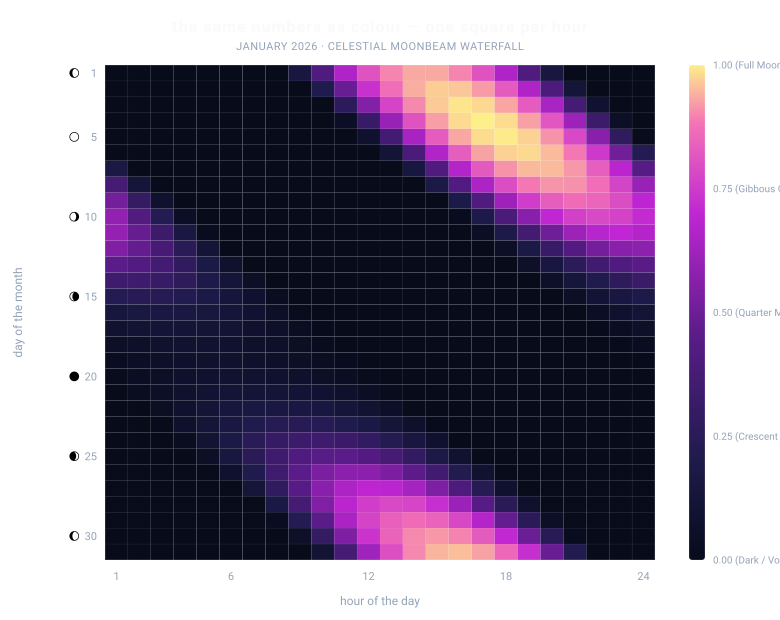

# The phenomenon
The visible window, elevation, and apparent brilliance of the Moon change continuously from day to day and season to season. This visualization captures three intertwined astronomical phenomena across Hong Kong's 2026 night sky:

1. **Daily Orbital Lag (~50 Minutes/Day)**: Because the Moon orbits the Earth in the same prograde direction as Earth's rotation, it advances approximately $13.2^\circ$ eastward along its orbit each day. Consequently, Earth must rotate an extra ~50 minutes every 24 hours to bring the Moon back to the same celestial meridian. This fundamental orbital mechanism causes moonrise, culmination (highest transit), and moonset to drift steadily later each day, visually manifesting as the prominent diagonal cascades slanting across the 24-hour diurnal grid.
2. **Synodic Illumination Cycle (~29.53 Days)**: As the Moon orbits Earth relative to the Sun, its illuminated hemisphere transitions through the lunar phases—from invisible New Moon (0% illumination) to radiant Full Moon (100% illumination) and back over a synodic month. This cycle directly modulates the apparent luminance in the sky: even when high above the horizon, a New Moon casts almost no visible light and remains visually obscured by diurnal glare, whereas a Full Moon dominates the midnight zenith.
3. **Diurnal Invisibility & Nocturnal Dominance**: The Moon spends roughly half of its lifetime in the daytime sky, where scattered solar Rayleigh radiation washes out lunar contrast. By mathematically combining geometric altitude above the local horizon with surface illumination fractions, this chart highlights true nocturnal visibility—illustrating when moonlight penetrates the darkness versus when the Moon silently traverses the daylit dome unnoticed. Across a full year, these mechanics interlock to weave 12.4 repeating diagonal waterfalls across the 8,760 hours of 2026.
<!-- What goes up and down, and why you looked at it. -->



> 🌕 **[Explore the 365-Day Interactive Celestial Scrubber (Live Demo)](https://qiugeapple.github.io/hk-moon-ring/out/moon_heatmap.html)**
> *(Drag the timeline scrubber across all 365 days of 2026 to watch the 12+ diagonal lunar cascades roll across the sky)*

## The phenomenon
The visible time window of the moon changes day-by-day across each month. Because the moon orbits the Earth in roughly 29.53 days, moonrise and lunar transit lag by approximately 50 minutes each calendar day. Based on the Hong Kong Observatory 2026 lunar ephemeris records, this visualization models the continuous diurnal elevation and surface illumination of the moon across all 8,760 hours (365 days × 24 hours) of 2026. Brighter golden tones represent hours when a luminous moon is high above the horizon, while deep violet-indigo tones represent daytime invisibilities or New Moon phases.
<!-- What goes up and down, and why you looked at it. -->

## The source
Data comes from the Hong Kong Observatory Open Data API:
https://data.weather.gov.hk/weatherAPI/opendata/opendata.php?dataType=MRS&year=2026&rformat=csv
The source CSV contains daily records of moonrise, lunar transit (culmination), and moonset clock times across 2026. Because celestial transit events skip a calendar day roughly once every month, missing records are handled using a physics-based orbital continuity model rather than dropping data rows.

## What the picture shows
The visualization maps the entire calendar year along the vertical timeline and the 24 hours of the diurnal cycle along the horizontal axis. Each cell's color represents a synthesized lunar luminance index (0.0 to 1.0) derived by combining geometric elevation proximity with synodic surface illumination percentages.
- **Static Overview (`out/moon_heatmap.svg`)**: Captures a high-resolution 31-day snapshot (January 2026) demonstrating the initial ~50-minute daily drift and phase modulation.
- **Interactive Scrubber (`out/moon_heatmap.html`)**: Allows users to scrub dynamically through all 365 days of 2026 using an interactive date axis, zoom between monthly (30d), quarterly (90d), and full-year (365d) view spans, and inspect exact rise/transit/set metrics via hover.

## Run it
```bash
uv run fetch.py
uv run plot_heatmap.py